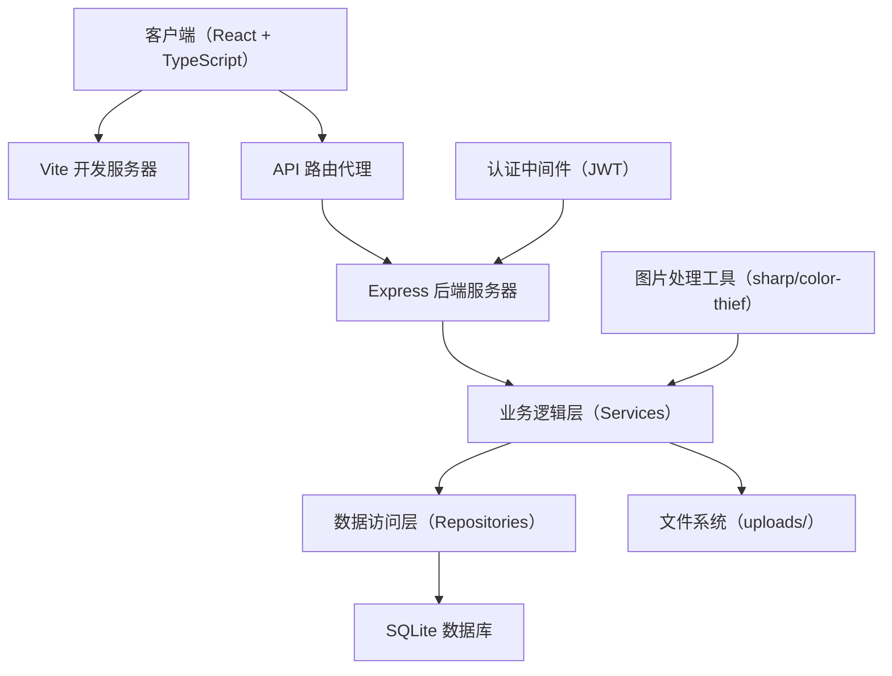
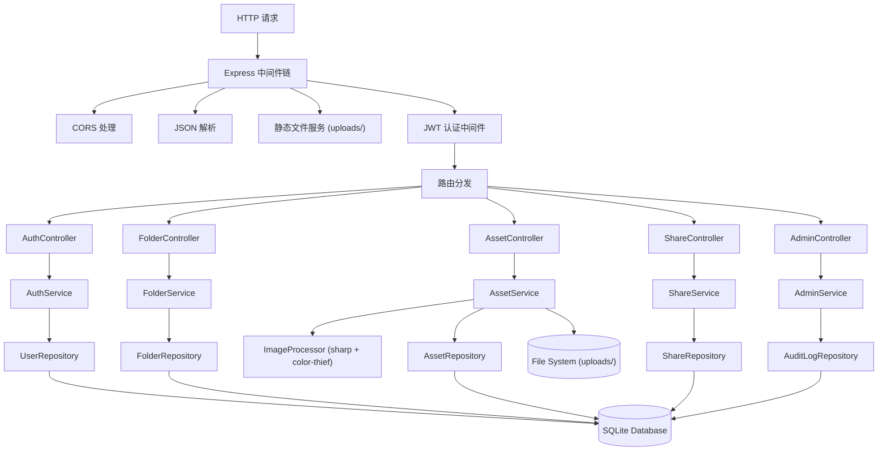
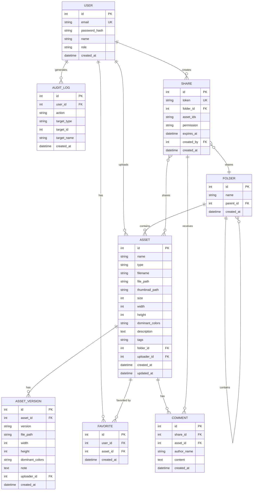

## 1. 架构设计



### 架构层级说明

- **前端层**：React 18 + TypeScript + Tailwind CSS，负责用户界面和交互
- **API 网关**：Express.js 提供 RESTful API，统一处理请求路由
- **业务逻辑层**：封装核心业务规则，如权限校验、文件处理、分享逻辑
- **数据访问层**：使用 better-sqlite3 操作数据库，提供数据持久化
- **文件存储**：本地文件系统存储上传的素材文件和生成的缩略图

---

## 2. 技术描述

### 2.1 技术栈选型

| 层级 | 技术选型 | 版本 | 用途 |
|------|----------|------|------|
| 前端框架 | React | 18.x | 用户界面构建 |
| 前端语言 | TypeScript | 5.x | 类型安全 |
| 构建工具 | Vite | 5.x | 构建与开发服务器 |
| 状态管理 | Zustand | 4.x | 全局状态管理 |
| 路由 | react-router-dom | 6.x | 前端路由 |
| UI 样式 | Tailwind CSS | 3.x | 原子化 CSS |
| 图标库 | lucide-react | 0.x | 图标组件 |
| 后端框架 | Express | 4.x | API 服务器 |
| 数据库 | SQLite (better-sqlite3) | 11.x | 轻量级关系型数据库 |
| 图片处理 | sharp | 0.33.x | 图片压缩、缩略图生成 |
| 颜色提取 | color-thief-node | 1.x | 提取图片主色调 |
| 文件上传 | multer | 1.4.x | 处理文件上传 |
| 认证 | jsonwebtoken | 9.x | JWT 认证 |
| 密码加密 | bcryptjs | 2.x | 密码哈希 |
| 拖拽库 | @dnd-kit/core | 6.x | 拖拽操作 |

### 2.2 项目初始化

- **初始化工具**：`vite-init`
- **模板**：`react-express-ts`（React + TypeScript + Express.js 全栈模板）
- **包管理器**：pnpm（优先）或 npm

---

## 3. 路由定义

### 3.1 前端路由

| 路由路径 | 页面组件 | 权限要求 | 说明 |
|----------|----------|----------|------|
| `/login` | `Login` | 公开 | 登录页面 |
| `/register` | `Register` | 公开 | 注册页面 |
| `/` | `Library` | 需要登录 | 素材库首页（文件夹树+缩略图） |
| `/asset/:id` | `AssetDetail` | 需要登录 | 素材详情页 |
| `/workspace` | `Workspace` | 需要登录 | 个人工作台 |
| `/admin` | `Admin` | 需要管理员 | 管理后台 |
| `/share/:token` | `ShareView` | 公开（需token验证） | 分享访问页 |
| `*` | `NotFound` | - | 404 页面 |

### 3.2 后端 API 路由

| 方法 | 路径 | 模块 | 说明 |
|------|------|------|------|
| POST | `/api/auth/register` | auth | 用户注册 |
| POST | `/api/auth/login` | auth | 用户登录 |
| GET | `/api/auth/me` | auth | 获取当前用户信息 |
| GET | `/api/folders` | folders | 获取文件夹树 |
| POST | `/api/folders` | folders | 创建文件夹 |
| PUT | `/api/folders/:id` | folders | 重命名文件夹 |
| DELETE | `/api/folders/:id` | folders | 删除文件夹 |
| GET | `/api/assets` | assets | 获取素材列表（支持筛选/搜索） |
| GET | `/api/assets/:id` | assets | 获取素材详情 |
| POST | `/api/assets/upload` | assets | 上传素材（含图片处理） |
| POST | `/api/assets/:id/version` | assets | 上传新版本 |
| PUT | `/api/assets/:id` | assets | 更新素材信息（描述/标签） |
| DELETE | `/api/assets/:id` | assets | 删除素材 |
| POST | `/api/assets/:id/favorite` | assets | 收藏/取消收藏 |
| POST | `/api/assets/move` | assets | 批量移动素材 |
| POST | `/api/shares` | shares | 创建分享链接 |
| GET | `/api/shares/:token` | shares | 验证分享并获取内容 |
| POST | `/api/shares/:token/comment` | shares | 添加评论（评论权限） |
| DELETE | `/api/shares/:id` | shares | 取消分享 |
| GET | `/api/admin/users` | admin | 获取成员列表 |
| PUT | `/api/admin/users/:id/role` | admin | 修改用户角色 |
| DELETE | `/api/admin/users/:id` | admin | 移除成员 |
| GET | `/api/admin/logs` | admin | 获取操作日志 |
| GET | `/api/admin/stats` | admin | 获取存储统计数据 |

---

## 4. API 定义

### 4.1 类型定义（shared/types.ts）

```typescript
// 用户
export interface User {
  id: number;
  email: string;
  name: string;
  role: 'member' | 'admin';
  avatar?: string;
  createdAt: string;
}

// 文件夹
export interface Folder {
  id: number;
  name: string;
  parentId: number | null;
  children?: Folder[];
  assetCount: number;
  createdAt: string;
}

// 素材
export type AssetType = 'design' | 'reference' | 'font';

export interface Asset {
  id: number;
  name: string;
  type: AssetType;
  filename: string;
  filePath: string;
  thumbnailPath: string;
  size: number;
  width?: number;
  height?: number;
  dominantColors: string[];
  description?: string;
  tags: string[];
  folderId: number;
  uploaderId: number;
  uploader: User;
  isFavorite: boolean;
  versions: AssetVersion[];
  createdAt: string;
  updatedAt: string;
}

// 素材版本
export interface AssetVersion {
  id: number;
  assetId: number;
  version: string;
  filePath: string;
  width?: number;
  height?: number;
  dominantColors: string[];
  note?: string;
  uploaderId: number;
  createdAt: string;
}

// 分享
export type SharePermission = 'readonly' | 'comment';

export interface Share {
  id: number;
  token: string;
  folderId: number | null;
  assetIds: number[];
  permission: SharePermission;
  expiresAt?: string;
  createdBy: number;
  createdAt: string;
}

// 评论
export interface Comment {
  id: number;
  shareId: number;
  assetId: number;
  authorName: string;
  content: string;
  createdAt: string;
}

// 操作日志
export interface AuditLog {
  id: number;
  userId: number;
  user: User;
  action: 'upload' | 'delete' | 'move' | 'download' | 'share' | 'edit';
  targetType: 'asset' | 'folder';
  targetId: number;
  targetName: string;
  createdAt: string;
}

// 存储统计
export interface StorageStats {
  totalUsed: number;
  totalQuota: number;
  byUser: { userId: number; userName: string; used: number }[];
  byType: { type: AssetType; used: number; count: number }[];
}
```

### 4.2 请求/响应示例

**登录请求**
```typescript
// POST /api/auth/login
interface LoginRequest {
  email: string;
  password: string;
}

interface LoginResponse {
  token: string;
  user: User;
}
```

**上传素材响应**
```typescript
// POST /api/assets/upload
interface UploadAssetResponse {
  id: number;
  name: string;
  thumbnailPath: string;
  width: number;
  height: number;
  dominantColors: string[];
}
```

---

## 5. 服务器架构图



---

## 6. 数据模型

### 6.1 实体关系图



### 6.2 数据库初始化脚本（migrations/001_init.sql）

```sql
CREATE TABLE IF NOT EXISTS users (
  id INTEGER PRIMARY KEY AUTOINCREMENT,
  email TEXT UNIQUE NOT NULL,
  password_hash TEXT NOT NULL,
  name TEXT NOT NULL,
  role TEXT NOT NULL DEFAULT 'member',
  avatar TEXT,
  created_at DATETIME DEFAULT CURRENT_TIMESTAMP
);

CREATE TABLE IF NOT EXISTS folders (
  id INTEGER PRIMARY KEY AUTOINCREMENT,
  name TEXT NOT NULL,
  parent_id INTEGER REFERENCES folders(id) ON DELETE CASCADE,
  created_at DATETIME DEFAULT CURRENT_TIMESTAMP
);

CREATE TABLE IF NOT EXISTS assets (
  id INTEGER PRIMARY KEY AUTOINCREMENT,
  name TEXT NOT NULL,
  type TEXT NOT NULL CHECK(type IN ('design', 'reference', 'font')),
  filename TEXT NOT NULL,
  file_path TEXT NOT NULL,
  thumbnail_path TEXT NOT NULL,
  size INTEGER NOT NULL,
  width INTEGER,
  height INTEGER,
  dominant_colors TEXT NOT NULL DEFAULT '[]',
  description TEXT,
  tags TEXT NOT NULL DEFAULT '[]',
  folder_id INTEGER NOT NULL REFERENCES folders(id) ON DELETE CASCADE,
  uploader_id INTEGER NOT NULL REFERENCES users(id),
  created_at DATETIME DEFAULT CURRENT_TIMESTAMP,
  updated_at DATETIME DEFAULT CURRENT_TIMESTAMP
);

CREATE TABLE IF NOT EXISTS asset_versions (
  id INTEGER PRIMARY KEY AUTOINCREMENT,
  asset_id INTEGER NOT NULL REFERENCES assets(id) ON DELETE CASCADE,
  version TEXT NOT NULL,
  file_path TEXT NOT NULL,
  width INTEGER,
  height INTEGER,
  dominant_colors TEXT NOT NULL DEFAULT '[]',
  note TEXT,
  uploader_id INTEGER NOT NULL REFERENCES users(id),
  created_at DATETIME DEFAULT CURRENT_TIMESTAMP
);

CREATE TABLE IF NOT EXISTS shares (
  id INTEGER PRIMARY KEY AUTOINCREMENT,
  token TEXT UNIQUE NOT NULL,
  folder_id INTEGER REFERENCES folders(id) ON DELETE CASCADE,
  asset_ids TEXT NOT NULL DEFAULT '[]',
  permission TEXT NOT NULL CHECK(permission IN ('readonly', 'comment')),
  expires_at DATETIME,
  created_by INTEGER NOT NULL REFERENCES users(id),
  created_at DATETIME DEFAULT CURRENT_TIMESTAMP
);

CREATE TABLE IF NOT EXISTS comments (
  id INTEGER PRIMARY KEY AUTOINCREMENT,
  share_id INTEGER NOT NULL REFERENCES shares(id) ON DELETE CASCADE,
  asset_id INTEGER REFERENCES assets(id) ON DELETE SET NULL,
  author_name TEXT NOT NULL,
  content TEXT NOT NULL,
  created_at DATETIME DEFAULT CURRENT_TIMESTAMP
);

CREATE TABLE IF NOT EXISTS favorites (
  id INTEGER PRIMARY KEY AUTOINCREMENT,
  user_id INTEGER NOT NULL REFERENCES users(id) ON DELETE CASCADE,
  asset_id INTEGER NOT NULL REFERENCES assets(id) ON DELETE CASCADE,
  created_at DATETIME DEFAULT CURRENT_TIMESTAMP,
  UNIQUE(user_id, asset_id)
);

CREATE TABLE IF NOT EXISTS audit_logs (
  id INTEGER PRIMARY KEY AUTOINCREMENT,
  user_id INTEGER NOT NULL REFERENCES users(id),
  action TEXT NOT NULL CHECK(action IN ('upload', 'delete', 'move', 'download', 'share', 'edit')),
  target_type TEXT NOT NULL CHECK(target_type IN ('asset', 'folder')),
  target_id INTEGER NOT NULL,
  target_name TEXT NOT NULL,
  created_at DATETIME DEFAULT CURRENT_TIMESTAMP
);

-- 索引
CREATE INDEX IF NOT EXISTS idx_assets_folder_id ON assets(folder_id);
CREATE INDEX IF NOT EXISTS idx_assets_uploader_id ON assets(uploader_id);
CREATE INDEX IF NOT EXISTS idx_assets_type ON assets(type);
CREATE INDEX IF NOT EXISTS idx_folders_parent_id ON folders(parent_id);
CREATE INDEX IF NOT EXISTS idx_shares_token ON shares(token);
CREATE INDEX IF NOT EXISTS idx_audit_logs_user_id ON audit_logs(user_id);
CREATE INDEX IF NOT EXISTS idx_audit_logs_created_at ON audit_logs(created_at);

-- 初始数据：默认根文件夹
INSERT OR IGNORE INTO folders (id, name, parent_id) VALUES (1, '我的素材库', NULL);

-- 初始数据：管理员账号 (密码: admin123)
INSERT OR IGNORE INTO users (email, password_hash, name, role) VALUES 
('admin@example.com', '$2a$10$7EqJtq98hPqEX7fNZaFWoO1h7Gq4fKgJLXH6KpLQ5E5E5E5E5E5E5E', '系统管理员', 'admin');
```

---

## 7. 前端状态管理

### Zustand Store 结构

```typescript
// src/store/useAuthStore.ts
interface AuthState {
  user: User | null;
  token: string | null;
  isAuthenticated: boolean;
  login: (email: string, password: string) => Promise<void>;
  register: (email: string, password: string, name: string) => Promise<void>;
  logout: () => void;
  loadUser: () => Promise<void>;
}

// src/store/useAssetStore.ts
interface AssetState {
  assets: Asset[];
  folders: Folder[];
  currentFolderId: number;
  selectedIds: number[];
  searchQuery: string;
  filters: { type?: AssetType; color?: string; tag?: string };
  fetchFolders: () => Promise<void>;
  fetchAssets: () => Promise<void>;
  createFolder: (name: string, parentId: number) => Promise<void>;
  selectAsset: (id: number, multi?: boolean) => void;
  clearSelection: () => void;
  moveAssets: (assetIds: number[], targetFolderId: number) => Promise<void>;
  deleteAssets: (ids: number[]) => Promise<void>;
}
```

---

## 8. 关键技术实现说明

### 8.1 图片处理流程

1. 用户上传图片 → multer 接收文件到临时目录
2. 使用 sharp 读取图片，获取 width/height
3. 生成 300x300 缩略图保存到 uploads/thumbnails/
4. 使用 color-thief-node 提取 5 个主色调
5. 原图移动到 uploads/assets/ 目录
6. 所有元数据存入数据库

### 8.2 拖拽实现

- 使用 @dnd-kit/core 实现拖拽功能
- 支持单个素材拖拽到文件夹
- 支持多选后批量拖拽
- 拖拽过程中目标文件夹高亮显示

### 8.3 分享权限控制

- 生成唯一 token（uuid）作为分享标识
- 分享链接格式：`/share/{token}`
- 访问时校验 token 有效性和有效期
- 根据 permission 字段控制是否显示评论功能

### 8.4 操作日志

- 关键操作（上传、删除、移动、分享）自动记录
- 记录用户、操作类型、目标对象、时间
- 管理员可按条件筛选查看
