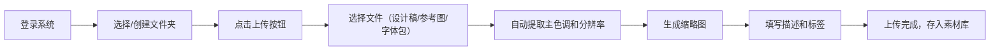
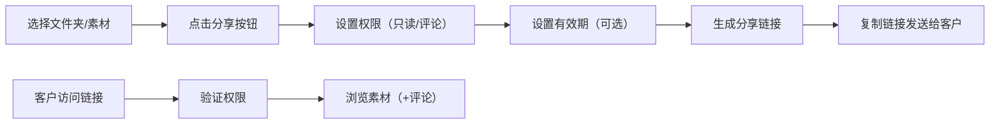
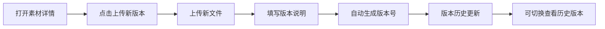

## 1. 产品概述

设计团队素材管理协作平台，解决设计团队素材分散、版本混乱、协作低效的问题。提供统一的素材存储、分类、检索和协作能力，支持设计稿、参考图、字体包的全生命周期管理。

- **核心价值**：提升设计团队素材管理效率，确保设计资产的可追溯性和复用性
- **目标用户**：设计团队成员、团队管理员、外部客户/合作伙伴
- **解决痛点**：素材散落各处难以查找、版本混乱无法追溯、团队协作缺乏权限管控、客户反馈流程繁琐

---

## 2. 核心功能

### 2.1 用户角色

| 角色 | 注册方式 | 核心权限 |
|------|----------|----------|
| 团队成员 | 邮箱注册 | 上传/下载素材、创建文件夹、添加标签、收藏素材、查看版本历史 |
| 团队管理员 | 邮箱注册（管理员标识） | 成员管理、权限分配、查看操作日志、存储统计、团队设置 |
| 外部客户 | 分享链接访问 | 根据权限设置查看素材、添加评论（评论权限）或仅浏览（只读权限） |

### 2.2 功能模块

1. **认证模块**：用户注册、登录、登出、密码管理
2. **素材管理**：上传（设计稿/参考图/字体包）、自动提取元数据（主色调/分辨率）、预览、下载、删除、版本历史
3. **文件夹管理**：文件夹树、创建/重命名/删除文件夹、拖拽分类、批量移动
4. **标签系统**：标签添加/编辑/删除、按标签筛选、描述信息
5. **分享功能**：生成分享链接、设置权限（只读/评论）、有效期管理、取消分享
6. **个人工作台**：最近上传、收藏内容、快捷操作
7. **管理后台**：成员列表、操作日志、存储使用统计、权限配置
8. **搜索筛选**：全文搜索、按类型/颜色/标签/时间筛选

### 2.3 页面详情

| 页面名称 | 模块名称 | 功能描述 |
|----------|----------|----------|
| 登录/注册页 | 认证表单 | 邮箱密码登录/注册、表单验证、错误提示 |
| 首页（素材库） | 文件夹树 | 左侧可折叠文件夹树，支持创建/重命名/删除 |
| 首页（素材库） | 缩略图网格 | 右侧素材缩略图展示，悬停显示操作按钮，支持多选批量操作 |
| 首页（素材库） | 工具栏 | 上传按钮、搜索框、筛选条件、视图切换、批量移动/删除 |
| 素材详情页 | 大图预览 | 高清预览、缩放、轮播切换版本 |
| 素材详情页 | 信息面板 | 描述、标签、分辨率、主色调、上传时间、版本历史 |
| 素材详情页 | 评论区 | 添加评论、回复、时间线展示 |
| 个人工作台 | 最近上传 | 卡片式展示最近上传的素材 |
| 个人工作台 | 我的收藏 | 收藏夹展示，支持取消收藏 |
| 管理后台 | 成员管理 | 成员列表、角色切换、移除成员 |
| 管理后台 | 操作日志 | 按成员/时间/操作类型筛选的日志列表 |
| 管理后台 | 存储统计 | 存储空间使用可视化图表、按成员/类型统计 |
| 分享访问页 | 分享视图 | 外部用户通过链接访问，根据权限展示不同功能 |

---

## 3. 核心流程

### 3.1 素材上传流程

### 3.2 素材分享流程

### 3.3 版本管理流程

---

## 4. 用户界面设计

### 4.1 设计风格

- **主色调**：深靛蓝 `#1e3a8a` 作为主色，搭配亮青色 `#06b6d4` 作为强调色
- **背景**：浅灰 `#f8fafc` 背景，白色卡片，营造专业简洁的工具感
- **按钮风格**：圆角 6px，主按钮实心填充，次要按钮描边，hover 有微妙的阴影变化
- **字体**：标题使用 `Inter SemiBold`，正文使用 `Inter Regular`，等宽字体使用 `JetBrains Mono` 展示技术信息
- **布局风格**：左右分栏布局，左侧固定宽度 280px 文件夹树，右侧自适应内容区
- **图标风格**：使用 Lucide 线性图标，统一 18px 尺寸，颜色与文本层级一致

### 4.2 页面设计概述

| 页面名称 | 模块名称 | UI Elements |
|----------|----------|-------------|
| 登录页 | 认证表单 | 居中卡片布局，渐变背景装饰，流畅的输入框焦点动画，错误提示微交互 |
| 首页 | 文件夹树 | 缩进层级结构，文件夹图标随展开/折叠旋转动画，hover 背景高亮，右键菜单 |
| 首页 | 缩略图网格 | CSS Grid 布局，响应式列数，卡片圆角 8px，悬停上浮效果，主色调色块点缀 |
| 首页 | 工具栏 | 粘性顶部，阴影分隔，搜索框聚焦展开动画，筛选标签圆角胶囊样式 |
| 素材详情 | 大图预览 | 黑色半透明背景遮罩，居中展示，支持键盘左右切换，平滑过渡动画 |
| 素材详情 | 信息面板 | 右侧固定抽屉，主色调用圆形色块展示，标签圆角胶囊，版本时间线 |
| 个人工作台 | 内容卡片 | 两列布局，最近上传和收藏并排，卡片缩略图+信息组合，hover 渐变遮罩 |
| 管理后台 | 数据统计 | 卡片式指标展示，存储使用环形进度条，日志表格斑马纹，分页控件 |

### 4.3 响应式设计

- **桌面端**（1280px+）：三栏布局完整展示，文件夹树 280px + 内容区自适应
- **平板端**（768px-1279px）：文件夹树可折叠收起，缩略图网格减少列数
- **移动端**（<768px）：底部导航，文件夹树改为下拉菜单，缩略图单列展示

### 4.4 动效设计

- 页面切换：淡入淡出 + 轻微上移动画，200ms 缓动
- 文件夹展开/折叠：高度过渡 + 图标旋转 180°，150ms
- 素材卡片悬停：translateY(-2px) + box-shadow 加深，150ms
- 模态框出现：scale(0.95) → scale(1) + 透明度过渡，200ms
- 按钮点击：scale(0.97) 回弹效果，80ms

---

## 5. 交互细节说明

### 5.1 拖拽操作

- 拖拽素材时显示半透明缩略图跟随鼠标
- 目标文件夹高亮显示（边框 + 背景色变化）
- 支持批量拖拽（多选后整体拖拽）
- 释放时显示确认提示（移动到 [文件夹名]？）

### 5.2 批量操作

- 按住 Shift 连续选择，按住 Ctrl/Cmd 点选
- 选择后顶部工具栏显示批量操作按钮（移动、删除、下载、打标签）
- 底部显示已选择数量和取消选择按钮

### 5.3 搜索体验

- 输入时实时搜索，防抖 300ms
- 搜索结果高亮匹配关键词
- 支持按文件类型、颜色、标签、上传时间组合筛选

### 5.4 图片预览

- 滚动鼠标滚轮缩放图片
- 按左右方向键切换版本
- 按 Esc 关闭预览
- 支持下载原图
